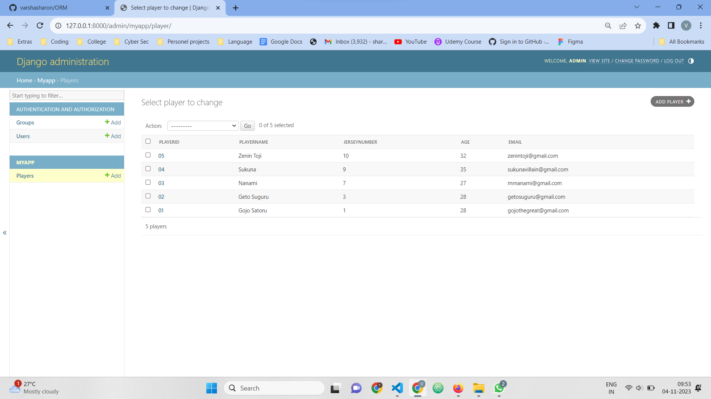

# Ex02 Django ORM Web Application

## Date: 4/11/2023

## AIM
To develop a Django application to store and retrieve data from a Football Players database using Object Relational Mapping(ORM).

## Entity Relationship Diagram

Include your ER diagram here

## DESIGN STEPS

### STEP 1:
Clone the problem from GitHub

### STEP 2:
Create a new app in Django project

### STEP 3:
Enter the code for admin.py and models.py

### STEP 4:
Execute Django admin and create 10 Football players

## PROGRAM

```
models.py

from django.db import models
from django.contrib import admin
class Player (models.Model):
    PlayerID=models.CharField(max_length=20,help_text="Player ID")
    PlayerName=models.CharField(max_length=100)
    JerseyNumber=models.IntegerField()
    Age=models.IntegerField()
    Email=models.EmailField()

class PlayerAdmin(admin.ModelAdmin):
    list_display=('PlayerID','PlayerName','JerseyNumber','Age','Email')

admin.py

from django.contrib import admin
from .models import Player, PlayerAdmin
admin.site.register(Player,PlayerAdmin)


```
## OUTPUT



## RESULT
Thus the program for creating a database using ORM hass been executed successfully
